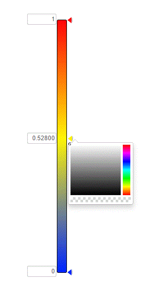

    <h2>MULTICOLORPICKER PLUGIN v1.0.1</h2>
     
    
A simple JQuery plugin. 

    

    <h2>Installation</h2>
     
    <h4>1. Copy MULTICOLORPICKER PLUGIN files to your app.</h4> 
    <h4>2. Include script after the jQuery library:</h4>
    <pre>"<"scriptsrc"="""//ajax.googleapis.com/ajax/libs/jquery/1.10.2/jquery.min.js"""></"script">" 
        <h4>3. Add styles to the head section of your webpage:</h4>
    
<pre>"<"link href="/path/to/multiColorPicker.css" rel="stylesheet"></pre>
 
            <h4>4. Initialize plugin</h4>
    
Add simple html to the body of your webpage:

    
<pre>"<"div data-element="multicolorpicker"></div></pre>
 
    
Add initialize script:

    
<pre>"<"script type="text/javascript" language="javascript">
        $(document).ready(function () {
            $('[data-element="multicolorpicker"]').multicolorpicker();
        });"<"/script></pre>
 

    <h2>Settings</h2>
     
    
Add to initialize script "multicolorpicker({'option':'value'});". If parameters don't set, plugin use the defaults.

    
<pre>
            
pinStartValue   : 0 //set start position

            
pinMidValue     : 0.5 //set middle position

            
pinEndValue     : 1 //set end position

            
pinStartColor   : #ff0509 //set color RGB

            
pinMidColor     : #fff605 //set color RGB

            
pinEndColor     : #0026ff //set color RGB

            
size            : 350 //set scrollbar-size(px)
</pre>

    <h2>Requirements</h2>
     
    <ul>
        <li>"jquery": "2.1.3"</li>
        <li>"bootstrap": "3.3.2"</li>
        <li>"jquery-ui": "1.11.4"</li>
        <li>"mjaalnir-bootstrap-colorpicker": "2.1"</li>
    </ul>

